# 足球预测系统 UML 图集

---

## 一、用户登录流程

### 顺序图

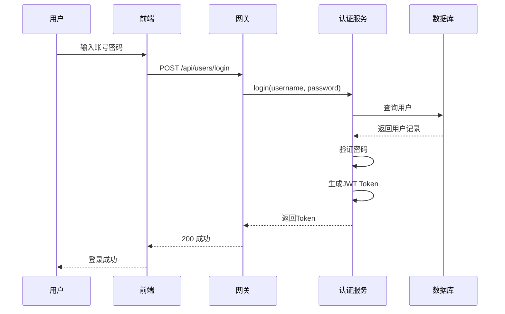

### 协作图

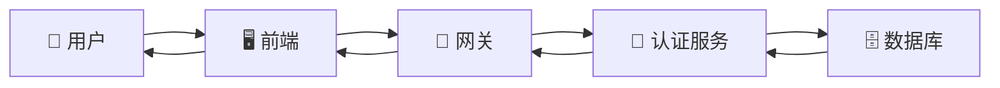

---

## 二、用户提交预测流程

### 顺序图

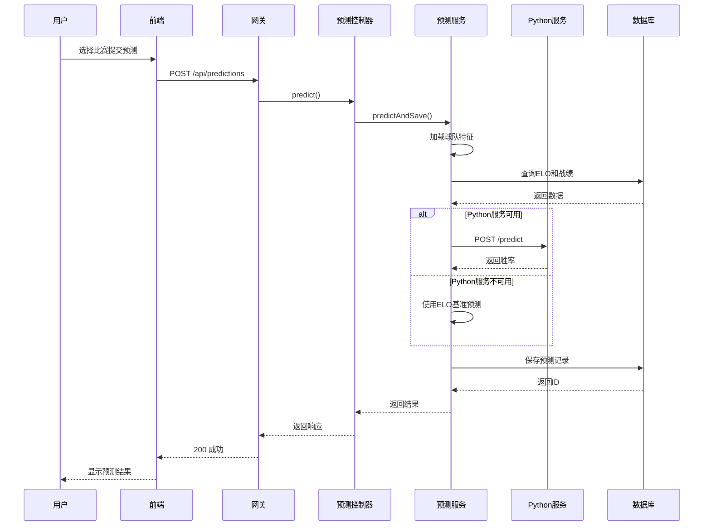

### 协作图

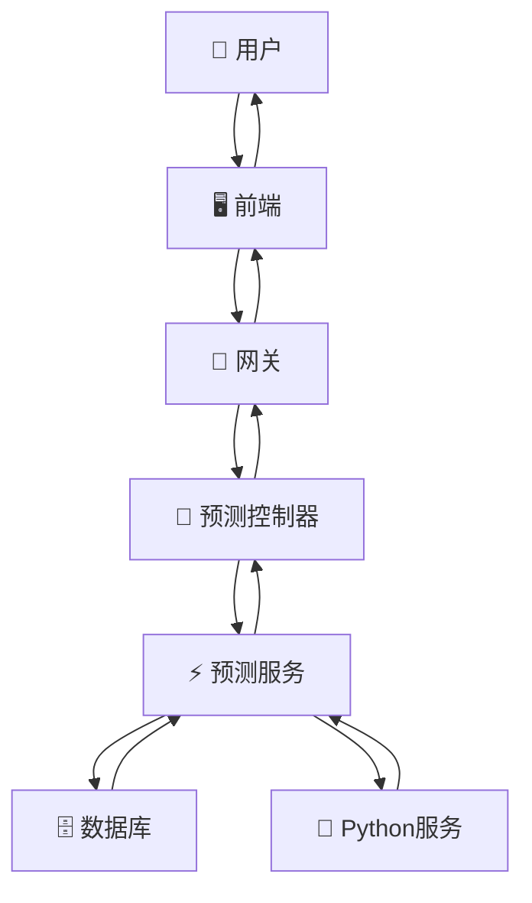

---

## 三、数据同步流程

### 顺序图

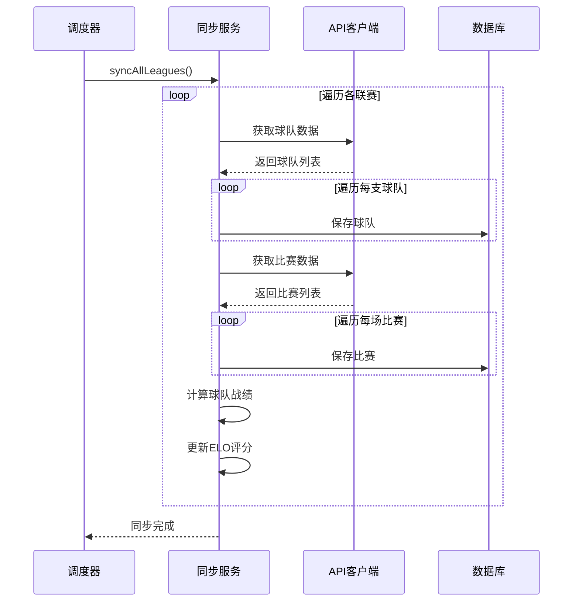

### 协作图

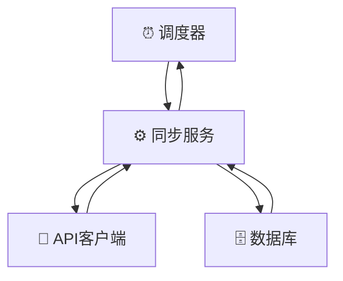

---

## 四、爬虫采集流程

### 顺序图

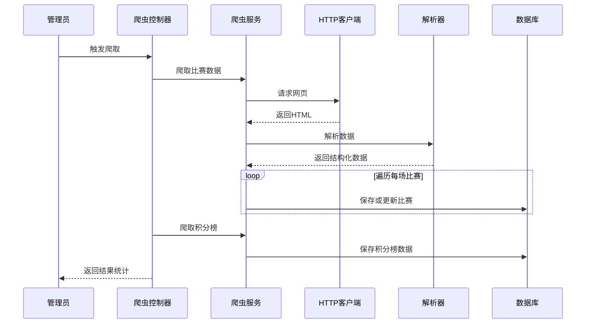

### 协作图

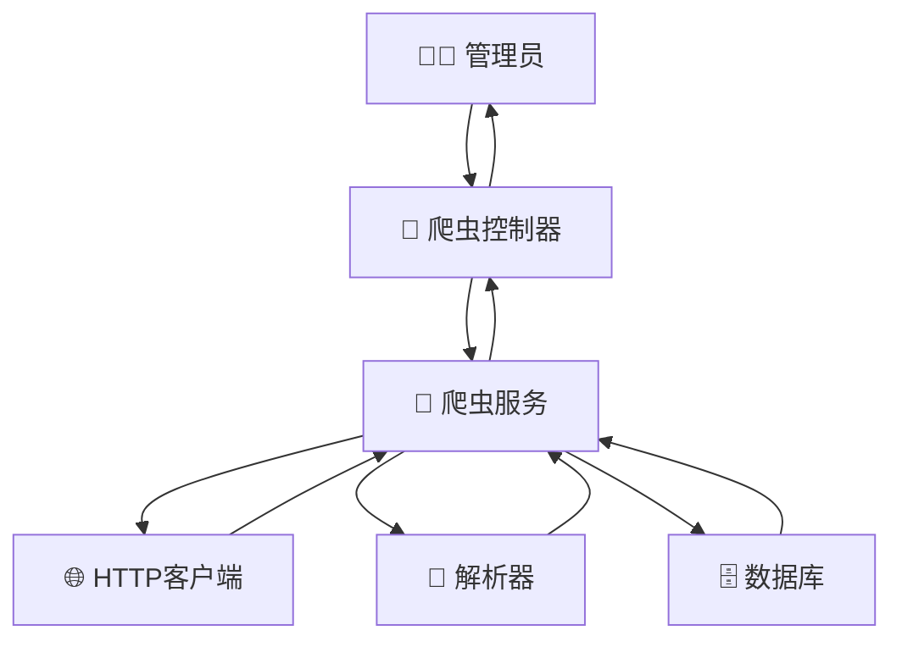

---

## 五、查看比赛列表流程

### 顺序图

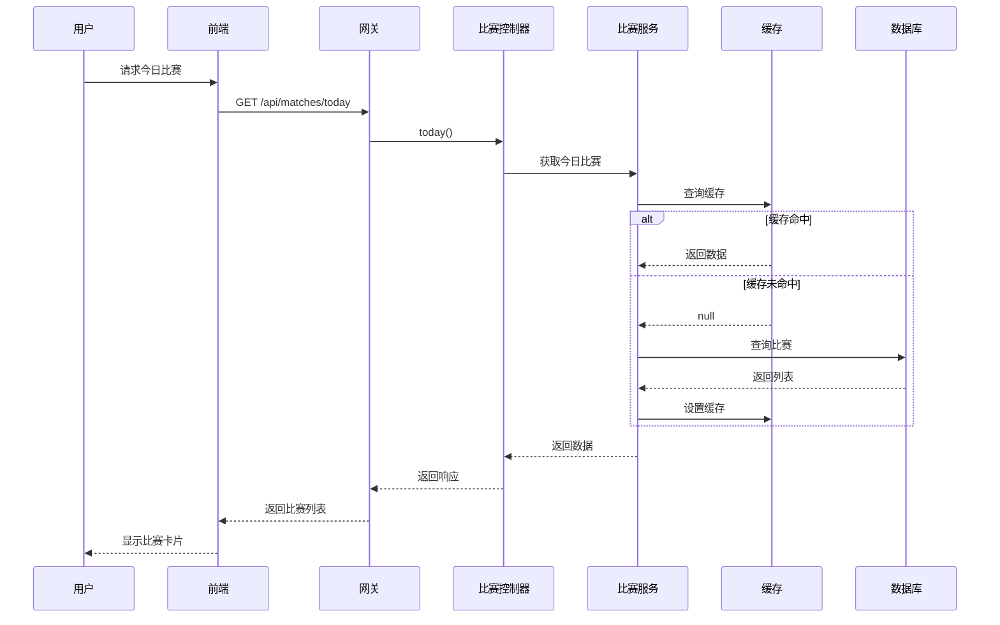

### 协作图

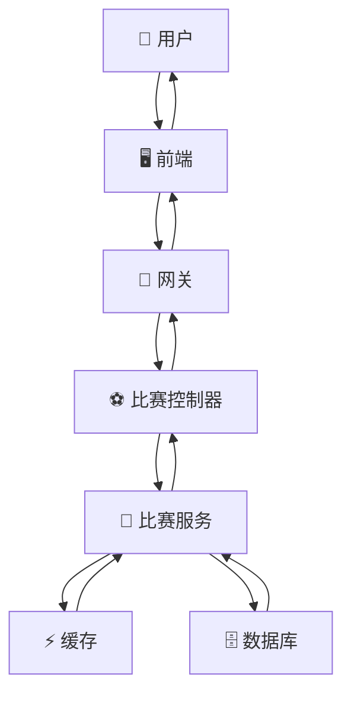

---

## 六、收藏球队流程

### 顺序图

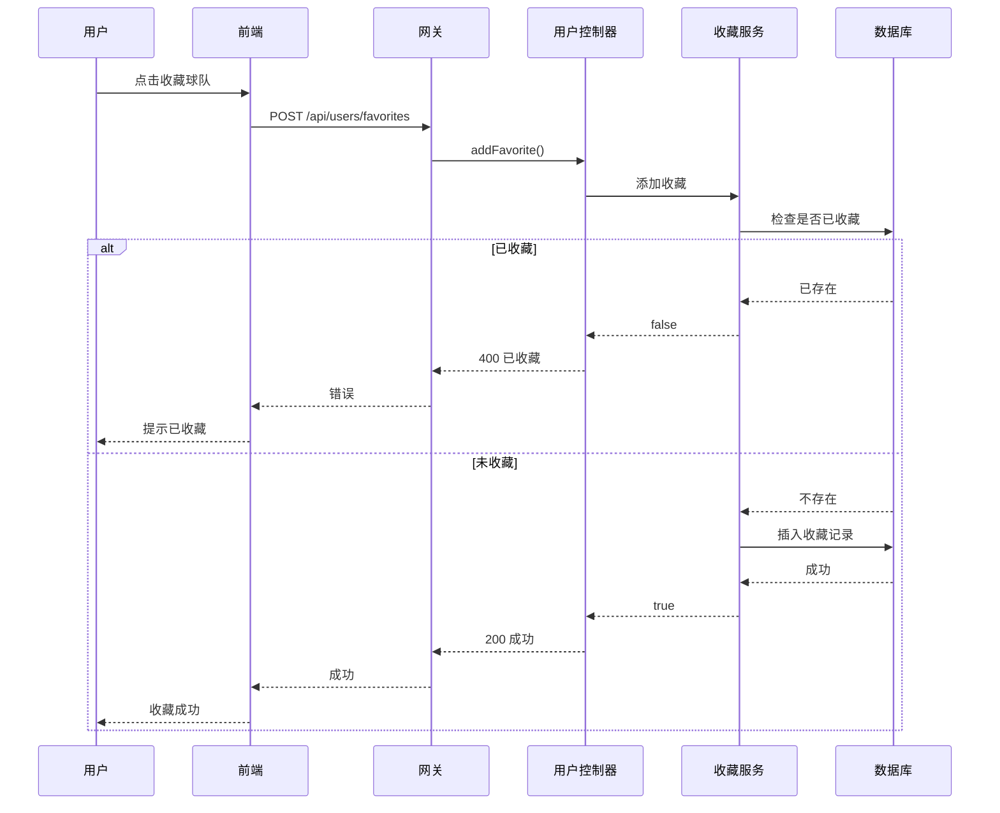

### 协作图

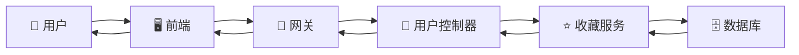

---

## 七、查看预测统计流程

### 顺序图

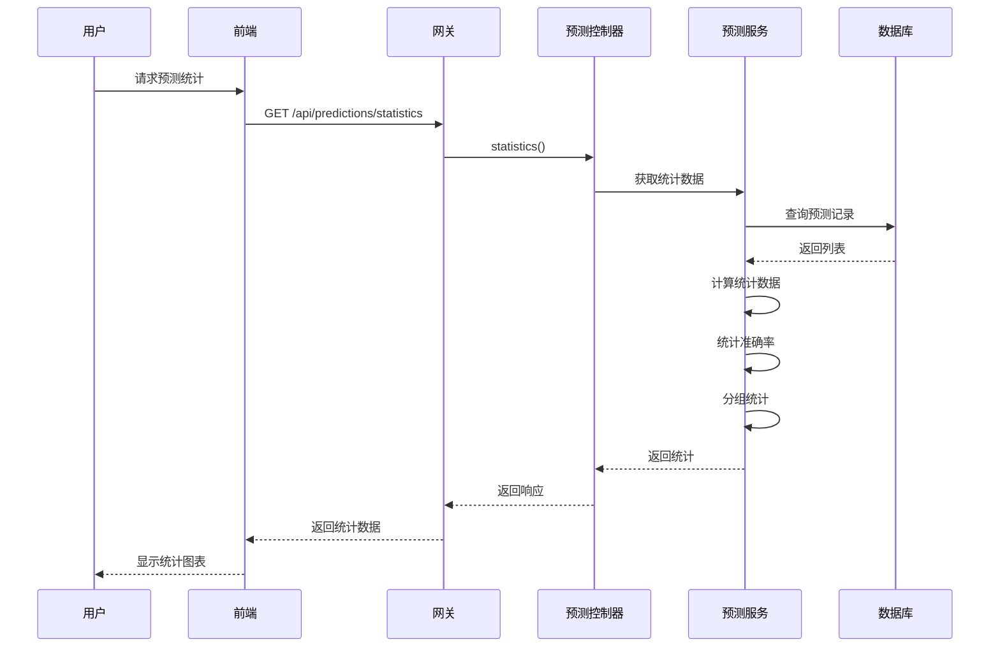

### 协作图

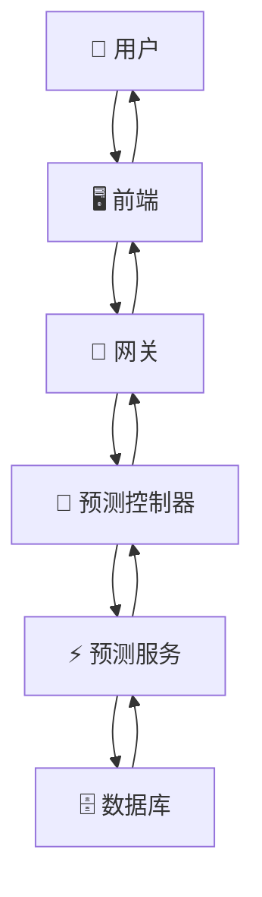

---

## 八、比赛结果验证流程

### 顺序图

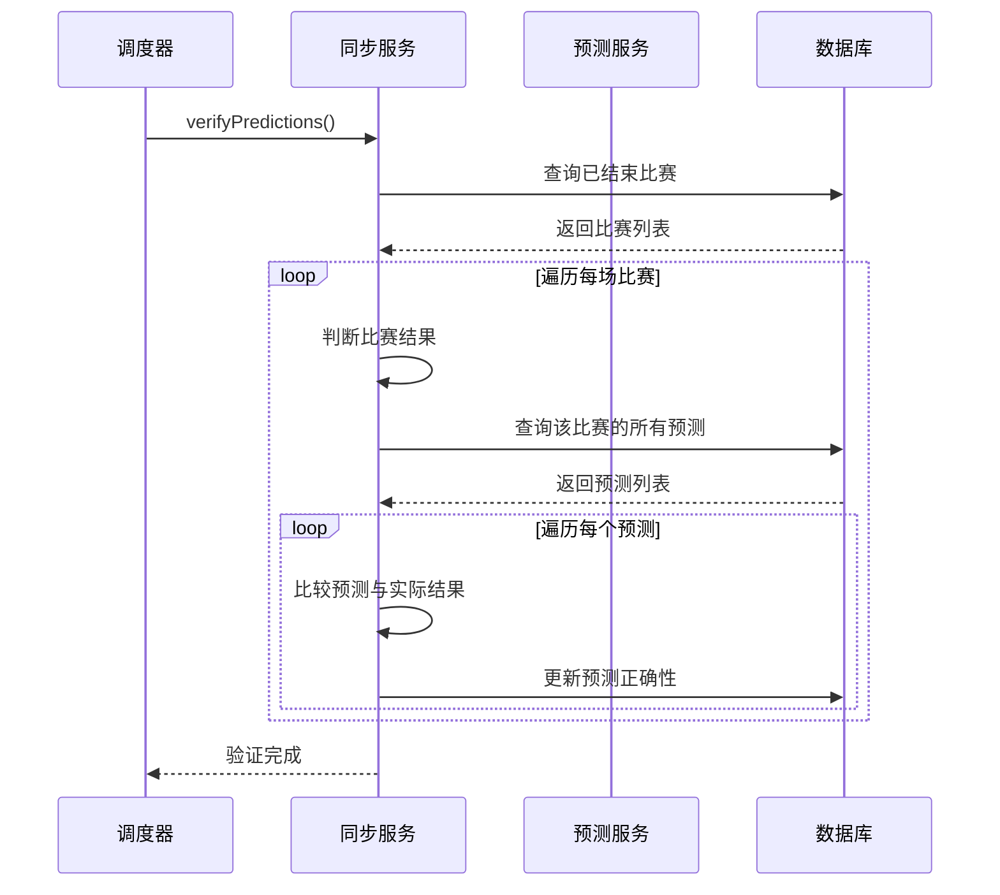

### 协作图

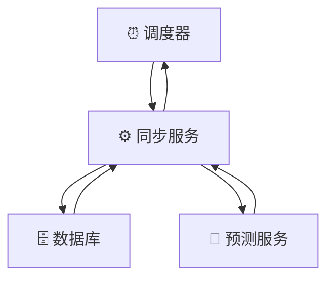
